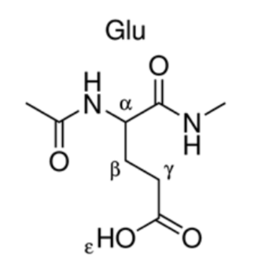
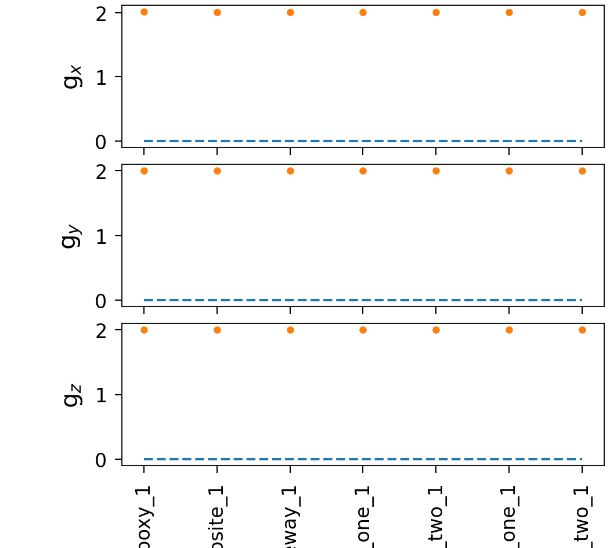
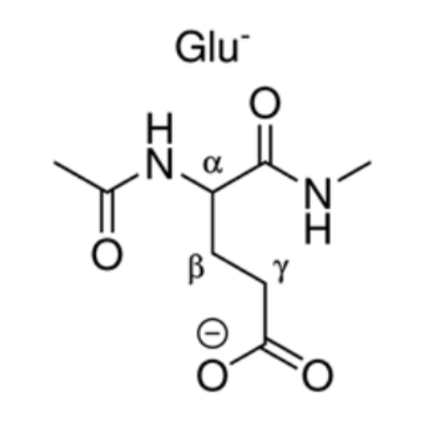
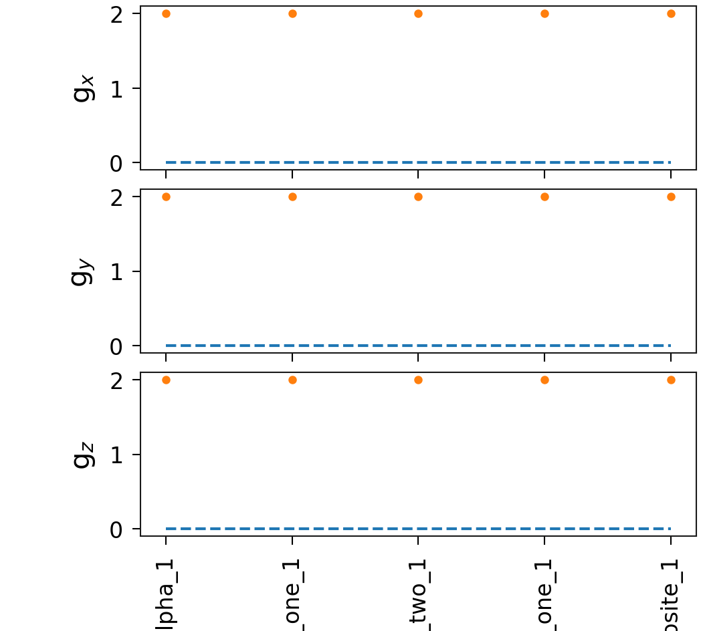
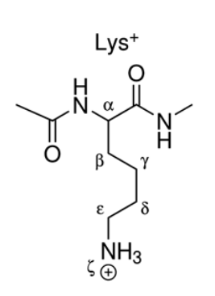
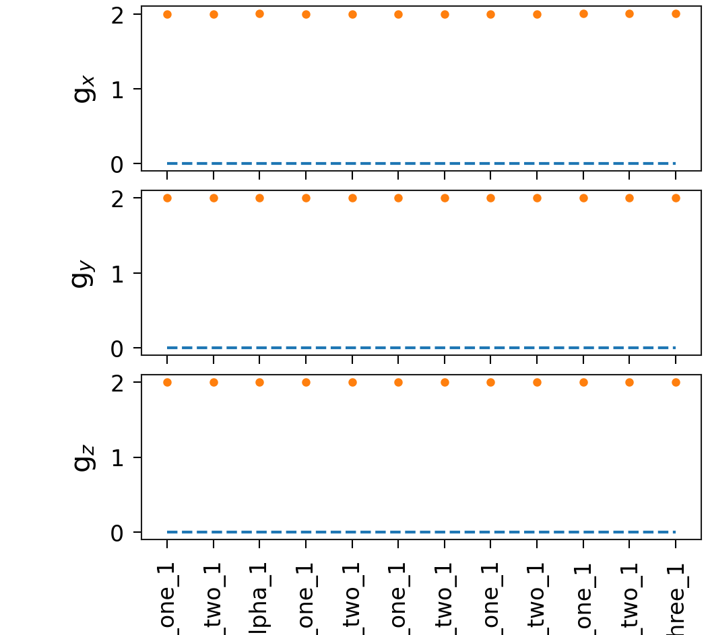
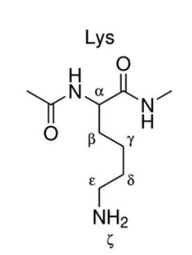
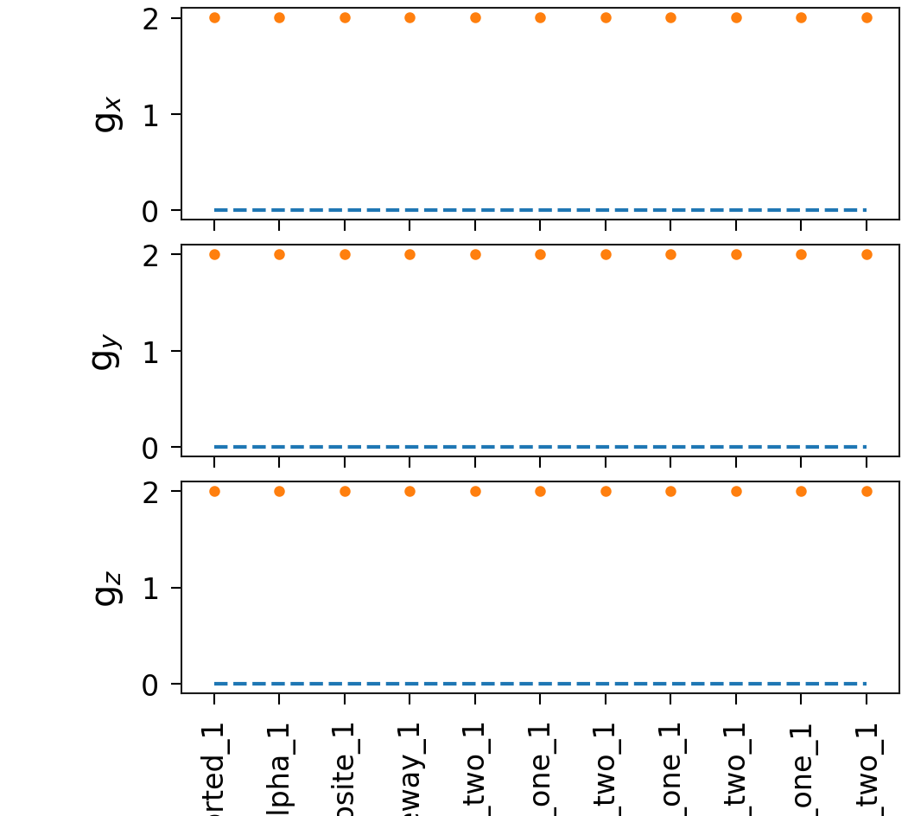
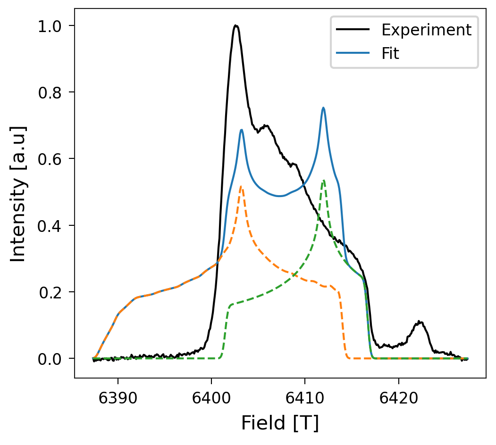

# PolyGlu \& PolyLys

This data corresponds to the theoretical prediction of g-values of Glutamine
and Lysine (charged and uncharged). This data is meant to be compared to
epr-spectrum obtained from polyGlu and polyLys sintetized peptides.

## Glu_uncharged

  

  

| System                                                                                            | $g_x$     | $g_y$     | $g_z$     | Max absolute error | Mean absolute error |
|---------------------------------------------------------------------------------------------------|-----------|-----------|-----------|--------------------|---------------------|
| Experiment                                                                                        | 0.0       | 0.0       | 0.0       |                    |                     |
| [01-Glu_uncharged_carboxy_1](Glu_uncharged/01-Glu_uncharged_carboxy_1/vmd_image.md)               | 2.0181067 | 2.0063524 | 2.0029578 | 2.0181067          | 2.0091390           |
| [02-Glu_uncharged_alpha_opposite_1](Glu_uncharged/02-Glu_uncharged_alpha_opposite_1/vmd_image.md) | 2.0044814 | 2.0036191 | 2.0020997 | 2.0044814          | 2.0034001           |
| [03-Glu_uncharged_alpha_oneway_1](Glu_uncharged/03-Glu_uncharged_alpha_oneway_1/vmd_image.md)     | 2.0044921 | 2.0036221 | 2.0020973 | 2.0044921          | 2.0034038           |
| [04-Glu_uncharged_gamma_one_1](Glu_uncharged/04-Glu_uncharged_gamma_one_1/vmd_image.md)           | 2.004947  | 2.0035372 | 2.0021931 | 2.0049470          | 2.0035591           |
| [05-Glu_uncharged_gamma_two_1](Glu_uncharged/05-Glu_uncharged_gamma_two_1/vmd_image.md)           | 2.0049356 | 2.0035399 | 2.0021899 | 2.0049356          | 2.0035551           |
| [06-Glu_uncharged_beta_one_1](Glu_uncharged/06-Glu_uncharged_beta_one_1/vmd_image.md)             | 2.0031512 | 2.0024177 | 2.0021005 | 2.0031512          | 2.0025565           |
| [07-Glu_uncharged_beta_two_1](Glu_uncharged/07-Glu_uncharged_beta_two_1/vmd_image.md)             | 2.0031902 | 2.002539  | 2.0020285 | 2.0031902          | 2.0025859           |

## Glu_charged

  

  

| System                                                                                            | $g_x$     | $g_y$     | $g_z$     | Max absolute error | Mean absolute error |
|---------------------------------------------------------------------------------------------------|-----------|-----------|-----------|--------------------|---------------------|
| Experiment                                                                                        | 0.0       | 0.0       | 0.0       |                    |                     |
| [01-Glu_charged_alpha_1](Glu_charged/01-Glu_charged_alpha_1/vmd_image.md)                         | 2.0043126 | 2.0035027 | 2.0019865 | 2.0043126          | 2.0032673           |
| [02-Glu_charged_gamma_one_1](Glu_charged/02-Glu_charged_gamma_one_1/vmd_image.md)                 | 2.0044329 | 2.0035195 | 2.0021811 | 2.0044329          | 2.0033778           |
| [03-Glu_charged_gamma_two_1](Glu_charged/03-Glu_charged_gamma_two_1/vmd_image.md)                 | 2.0044362 | 2.0035177 | 2.0021818 | 2.0044362          | 2.0033786           |
| [04-Glu_charged_beta_one_1](Glu_charged/04-Glu_charged_beta_one_1/vmd_image.md)                   | 2.0031043 | 2.0025563 | 2.0021538 | 2.0031043          | 2.0026048           |
| [05-Glu_charged_beta_two_opposite_1](Glu_charged/05-Glu_charged_beta_two_opposite_1/vmd_image.md) | 2.0030702 | 2.0027449 | 2.0021545 | 2.0030702          | 2.0026565           |

## Lys_charged

  

  

| System                                                                                | $g_x$     | $g_y$     | $g_z$     | Max absolute error | Mean absolute error |
|---------------------------------------------------------------------------------------|-----------|-----------|-----------|--------------------|---------------------|
| Experiment                                                                            | 0.0       | 0.0       | 0.0       |                    |                     |
| [01-Lys_charged_delta_one_1](Lys_charged/01-Lys_charged_delta_one_1/vmd_image.md)     | 2.0026829 | 2.0024822 | 2.0020926 | 2.0026829          | 2.0024192           |
| [02-Lys_charged_delta_two_1](Lys_charged/02-Lys_charged_delta_two_1/vmd_image.md)     | 2.002755  | 2.0024812 | 2.0021815 | 2.0027550          | 2.0024726           |
| [03-Lys_charged_alpha_1](Lys_charged/03-Lys_charged_alpha_1/vmd_image.md)             | 2.0041645 | 2.0035638 | 2.002107  | 2.0041645          | 2.0032784           |
| [04-Lys_charged_gamma_one_1](Lys_charged/04-Lys_charged_gamma_one_1/vmd_image.md)     | 2.0029418 | 2.0028008 | 2.0021979 | 2.0029418          | 2.0026468           |
| [05-Lys_charged_gamma_two_1](Lys_charged/05-Lys_charged_gamma_two_1/vmd_image.md)     | 2.0030399 | 2.0027793 | 2.0021738 | 2.0030399          | 2.0026643           |
| [06-Lys_charged_beta_one_1](Lys_charged/06-Lys_charged_beta_one_1/vmd_image.md)       | 2.0031905 | 2.0027468 | 2.0021981 | 2.0031905          | 2.0027118           |
| [07-Lys_charged_beta_two_1](Lys_charged/07-Lys_charged_beta_two_1/vmd_image.md)       | 2.0029235 | 2.0024952 | 2.0021005 | 2.0029235          | 2.0025064           |
| [08-Lys_charged_epsilon_one_1](Lys_charged/08-Lys_charged_epsilon_one_1/vmd_image.md) | 2.0029625 | 2.0025186 | 2.00214   | 2.0029625          | 2.0025404           |
| [09-Lys_charged_epsilon_two_1](Lys_charged/09-Lys_charged_epsilon_two_1/vmd_image.md) | 2.0029423 | 2.0024927 | 2.002136  | 2.0029423          | 2.0025237           |
| [10-Lys_charged_amine_one_1](Lys_charged/10-Lys_charged_amine_one_1/vmd_image.md)     | 2.0103008 | 2.0049182 | 2.003006  | 2.0103008          | 2.0060750           |
| [11-Lys_charged_amine_two_1](Lys_charged/11-Lys_charged_amine_two_1/vmd_image.md)     | 2.0102778 | 2.0049218 | 2.0029989 | 2.0102778          | 2.0060662           |
| [12-Lys_charged_amine_three_1](Lys_charged/12-Lys_charged_amine_three_1/vmd_image.md) | 2.0104476 | 2.0049269 | 2.0030114 | 2.0104476          | 2.0061286           |

## Lys_uncharged

  

  

| System                                                                                               | $g_x$     | $g_y$     | $g_z$     | Max absolute error | Mean absolute error |
|------------------------------------------------------------------------------------------------------|-----------|-----------|-----------|--------------------|---------------------|
| Experiment                                                                                           | 0.0       | 0.0       | 0.0       |                    |                     |
| [01-Lys_uncharged_delta_one_distorted_1](Lys_uncharged/01-Lys_uncharged_delta_one_distorted_1/vmd_image.md) | 2.0028007 | 2.002756  | 2.0021831 | 2.0028007          | 2.0025799           |
| [02-Lys_uncharged_alpha_1](Lys_uncharged/02-Lys_uncharged_alpha_1/vmd_image.md)                      | 2.0044905 | 2.0036317 | 2.0021113 | 2.0044905          | 2.0034112           |
| [03-Lys_uncharged_gamma_one_opposite_1](Lys_uncharged/03-Lys_uncharged_gamma_one_opposite_1/vmd_image.md) | 2.002852  | 2.0027949 | 2.0021758 | 2.0028520          | 2.0026076           |
| [04-Lys_uncharged_gamma_one_oneway_1](Lys_uncharged/04-Lys_uncharged_gamma_one_oneway_1/vmd_image.md) | 2.0028538 | 2.0027951 | 2.0021759 | 2.0028538          | 2.0026083           |
| [05-Lys_uncharged_gamma_two_1](Lys_uncharged/05-Lys_uncharged_gamma_two_1/vmd_image.md)              | 2.0029138 | 2.0027951 | 2.0022135 | 2.0029138          | 2.0026408           |
| [06-Lys_uncharged_beta_one_1](Lys_uncharged/06-Lys_uncharged_beta_one_1/vmd_image.md)                | 2.0031109 | 2.0024303 | 2.0021112 | 2.0031109          | 2.0025508           |
| [07-Lys_uncharged_beta_two_1](Lys_uncharged/07-Lys_uncharged_beta_two_1/vmd_image.md)                | 2.0031064 | 2.0024027 | 2.0021106 | 2.0031064          | 2.0025399           |
| [08-Lys_uncharged_epsilon_one_1](Lys_uncharged/08-Lys_uncharged_epsilon_one_1/vmd_image.md)          | 2.0030647 | 2.0027383 | 2.0021275 | 2.0030647          | 2.0026435           |
| [09-Lys_uncharged_epsilon_two_1](Lys_uncharged/09-Lys_uncharged_epsilon_two_1/vmd_image.md)          | 2.0030662 | 2.0027361 | 2.0021287 | 2.0030662          | 2.0026437           |
| [10-Lys_uncharged_amine_one_1](Lys_uncharged/10-Lys_uncharged_amine_one_1/vmd_image.md)              | 2.0069064 | 2.0036205 | 2.0021437 | 2.0069064          | 2.0042235           |
| [11-Lys_uncharged_amine_two_1](Lys_uncharged/11-Lys_uncharged_amine_two_1/vmd_image.md)              | 2.006818  | 2.0036615 | 2.002158  | 2.0068180          | 2.0042125           |

# Fitting with the best candidates

Given that the set of candidates could be large, this section filters the
candidates to those that contribute to the fitting with a minimum of the 5
percent. It also shows the percentage per candidates in tables.

## Best fit

  

| System | Percentage |
|--------|------------|
| [ Glu_uncharged/01-Glu_uncharged_carboxy_1 ](./Glu_uncharged/01-Glu_uncharged_carboxy_1/vmd_image.md) | 70.27077577991038 |
| [ Lys_uncharged/10-Lys_uncharged_amine_one_1 ](./Lys_uncharged/10-Lys_uncharged_amine_one_1/vmd_image.md) | 29.729224220089637 |
